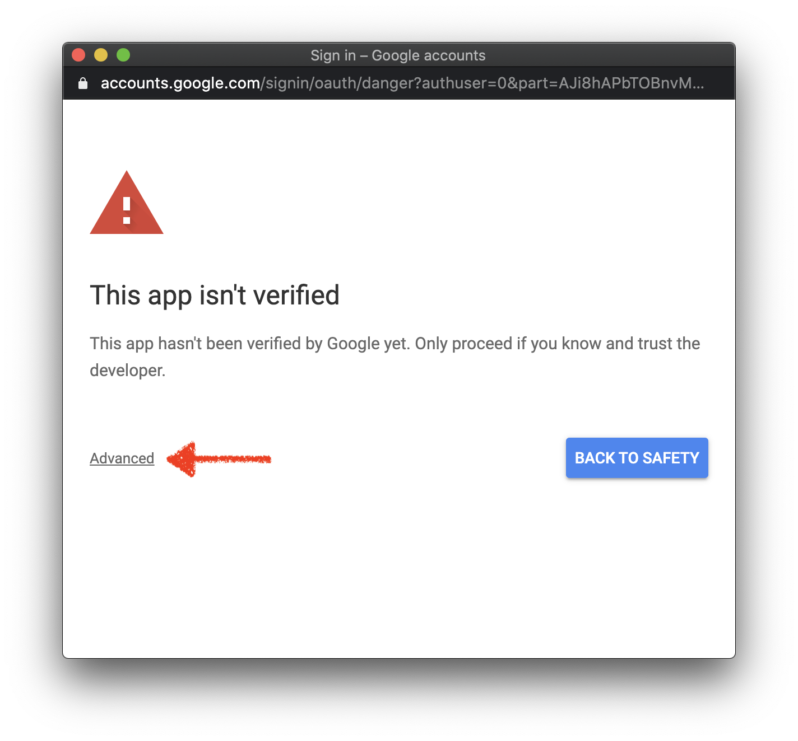
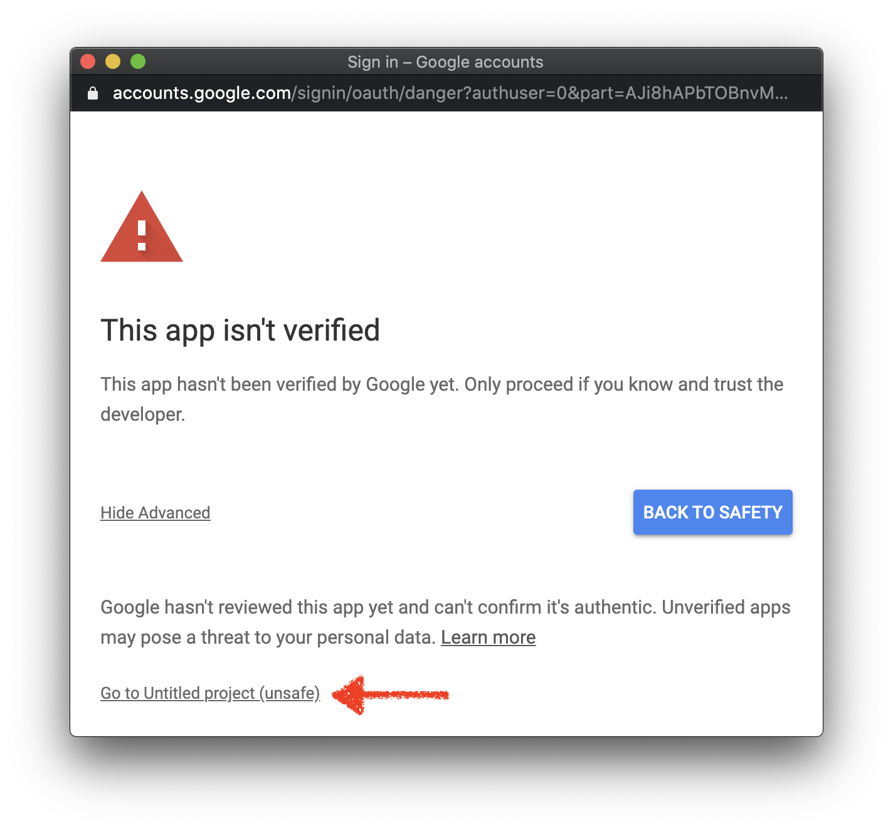

# Google Drive Unshare
Google Apps Script to unshare files and folders with someone and make a copy of
them.

# Features

- Unshare all files and folders with someone.
- Unshare a folder (incl. subfiles and subfolders) with someone.
- Transfer ownership: copy all files and folders owned by someone while
  unsharing them with that someone becoming the owner of them.

# Installation

1. Go to https://script.google.com/start and make sure you're signed in with the
   Google Drive account you want to use for this.
2. Copy & Paste the `Code.gs` in this repository into the default file and
   select the `main` function under "Select function"
3. In the code, set the `userEmail` variable to the email address of the user
   you want unshare items with and optionally set `copyNotOwned` variable to
   `true` if you want to also copy the items. If you want to unshare a specific
   folder (incl. subfolders and subfiles), set the `folderId` variable
   (everything after https://drive.google.com/drive/folders/ of the folder URL).
4. Hit run! (You will probably also be prompted grant permission to your drive
   so do that)
   
   